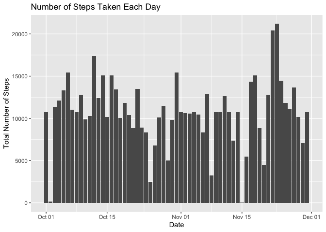

## Loading and preprocessing the data

Load packages, then read the data into a data.frame.  The unzipped data file "activity.csv" must be in the working directory.  


```r
library(dplyr)
```

```
## Warning: package 'dplyr' was built under R version 3.5.2
```

```
## 
## Attaching package: 'dplyr'
```

```
## The following objects are masked from 'package:stats':
## 
##     filter, lag
```

```
## The following objects are masked from 'package:base':
## 
##     intersect, setdiff, setequal, union
```

```r
library(ggplot2)
```

```
## Warning: package 'ggplot2' was built under R version 3.5.2
```

```r
activity <- read.table("activity.csv", header = TRUE, sep = ",", colClasses = c("integer", "Date", "integer"))
```


## What is mean total number of steps taken per day?

Calculate the total number of steps taken per day.


```r
daySteps <- activity %>% 
              group_by(date) %>% 
              summarize(total = sum(steps, na.rm = TRUE))
```

Next, we create a histogram of the total number of steps taken each day.


```r
ggplot(daySteps, aes(x=date, y = total)) + geom_col() + labs(x = "Date", 
                                                             y = "Total Number of Steps", 
                                                            title = "Number of Steps Taken Each Day")
```

<!-- -->

Calculate and report the mean and median number of steps taken per day.


```r
meanSteps <- mean(daySteps$total)
medSteps <- median(daySteps$total)
```

The mean number of steps taken per day is 9354.2295082 and the median number of steps taken per day is 10395.

## What is the average daily activity pattern?

Calculate the average number of steps taken (across all days in the dataset) in each five-minute interval.  Then plot this information.


```r
timeSteps <- activity %>% 
              group_by(interval) %>% 
              summarize(mean = mean(steps, na.rm = TRUE))

ggplot(timeSteps, aes(x=interval, y = mean)) + geom_line() + labs(x = "Five-minute Time Period", 
                                                             y = "Average Number of Steps", 
                                                            title = "Average Daily Activity Pattern")
```

<!-- -->

We see that the graph has one clear peak, so next we calculate the 5-minute interval, on average across all the days in the dataset, has the maximum number of steps.


```r
timeSteps[which.max(timeSteps$mean),]
```

```
## # A tibble: 1 x 2
##   interval  mean
##      <int> <dbl>
## 1      835  206.
```

This tells us that the interval with the maximum average number of steps is the time period from 8:35 to 8:40, and on average the subject took 206 steps during that time period.

## Imputing missing values

The total number of missing values in the dataset is equal to the number of rows with NA's in the activity data.frame.  We'll calculate this number now.


```r
Missing <- sum(is.na(activity$steps))
```
There are 2304 missing values in the dataset.

We will fill in these missing values with the average number of steps taken in the 5-minute time period in question over the days for which observations exist.  First, we create a new data.frame (called activityImputed) with the same column names as the activity data.frame.  Then, we use a while loop to copy the rows of the activity data.frame to activityImputed one at a time, replacing the steps entry in those rows that have a missing (NA) value with the average number of steps taken in that 5-minute time period over the days for which observations exist.  


```r
activityImputed <- data.frame(matrix(ncol = 3, nrow = 0))
colnames(activityImputed) <- c("steps", "date", "interval")

i <- 1
while (i %in% 1:nrow(activity)){
  activityImputed <- rbind(activityImputed, activity[i, ])
  if (is.na(activity$steps[i])) {
      activityImputed$steps[i] <- timeSteps$mean[timeSteps$interval == activity$interval[i]]
  }
  i <- i+1
}
```

Next, using the imputed values instead of missing entries, we calculate the total number of steps taken per day.


```r
dayStepsImputed <- activityImputed %>% 
              group_by(date) %>% 
              summarize(total = sum(steps, na.rm = TRUE))
```

Next, we create a histogram of the total number of steps taken each day, again using the imputed values instead of missing entries.


```r
ggplot(dayStepsImputed, aes(x=date, y = total)) + geom_col() + labs(x = "Date", 
                                                                    y = "Total Number of Steps", 
                                                                    title = "Number of Steps Taken Each Day")
```

<!-- -->

Calculate and report the mean and median number of steps taken per day.


```r
meanStepsImputed <- mean(dayStepsImputed$total)
medStepsImputed <- median(dayStepsImputed$total)
```

Using imputed values to replace missing values, the mean number of steps taken per day is 10766.19 and the median number of steps taken per day is 10766.19.  As one might expect, these values are a bit higher than the values we get when computing the mean and median number of steps per day omitting the missing values, because imputing the missing values adds steps to days with missing values.  It is surprising (and I wonder if there is an error somewhere) that imputing the missing values caused the mean and median number of steps taken per day to equal each other.

## Are there differences in activity patterns between weekdays and weekends?

In order to investigate whether there is a difference in the pattern of daily activity between weekdays and weekend days, we will add a factor variable to the imputed dataset which indicates whether each date represents a weekday or a weekend day.


```r
days <- weekdays(activityImputed$date)

i <- 1
while (i %in% 1:nrow(activity)){
          if (days[i] %in% c("Monday", "Tuesday", "Wednesday", "Thursday", "Friday")) {
                  days[i] <- "weekday"
          }
          else {
                days[i] <- "weekend"
          }
 i <- i+1
}


days <- factor(days)
activityImputed <- cbind(activityImputed, days)
```

Next, we make a panel plot comparing the average daily activity patterns on weekdays versus weekends.  The x-axis represents the time of day, and the y-axis of each panel shows the average number of steps in each 5-minute time interval (using the dataset with the imputed values replacing the missing values in the original dataset).


```r
timeStepsImputed <- activityImputed %>% 
              group_by(interval, days) %>% 
              summarize(mean = mean(steps))

ggplot(timeStepsImputed, aes(x=interval, y = mean)) + geom_line() + facet_grid(rows = vars(days)) + labs(x = "Five-minute Time Period", 
                                                                                                        y = "Average Number of Steps", 
                                                                                                        title = "Average Daily Activity by Days")
```

<!-- -->

Based on looking at the panel plot, it appears that on weekdays the subject on average took more steps in the morning than on weekend days, but on weekend days the subject took slightly more steps after approximately 10am than on weekdays.  
